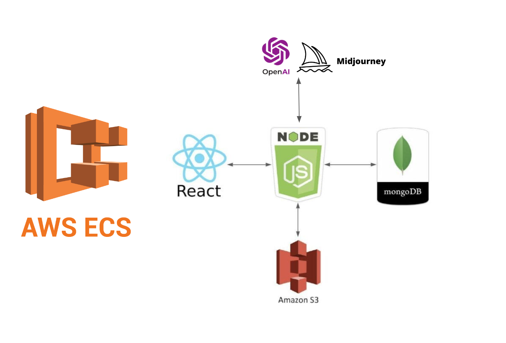

# AI-Persona: Web Application Architectural Design Document

## 1. Introduction

The purpose of this document is to outline the architectural design for an AI persona web application that involves integration with various technologies, including Next.js via React for the frontend, Amazon S3 for storage and containerizarion, openAI's DALL-E or Midjourney for persona image generation, chatGPT for motto generation, and MongoDB for data persistence. The application's primary functionality is to process a user request to generate an artificial social media persona (image and phrase).

## 2. System Architecture

### 2.1 Frontend (Next.js)

The frontend is built using Next.js, a React framework. It will handle user input, send requests to the backend, and display generated contents.

### 2.2 Backend

The backend is responsible for coordinating the workflow between the frontend, openAI, Amazon S3, and MongoDB. It is implemented using Node.js with Express.

#### 2.2.1 Communication with MongoDB

The backend connects to MongoDB to store and retrieve data. It will perform "upsert" operations to manage images associated with user generated persona names.

#### 2.2.2 Communication with DALL-E / Midjourney

The backend communicates with openAI's DALL-E or Midourney to generate an image persona based on user input (persona name & descriptive prompt). After sending a request, a generated image URL is returned.

#### 2.2.3 Communication with chatGPT
The backend communicates with chatGPT using the original descriptive prompt input for image generation, as well as a categorial motto-tone, this acts as a personality flavor to help chatGPT generate a suitable motto. In response, chatGPT generates a personalised phrase which is linked back to the generated persona.

### 2.3 Persona Generation Workflow

1. **Frontend Request**: User input consisting of name, descriptive prompt and motto-tone is sent from the frontend to the backend.

2. **Communication with MongoDB**: The backend checks MongoDB to see if there is an existing image associated with the provided persona name.

3. **Communication with openAI (DALL-E Midjourney)**: If the persona name is not found, the backend sends a request to openAI's DALL-E or Midjourney to generate a new image for the provided person name.

4. **Image URL**: openAI/Midjourney responds with a newly generated image URL for the generated persona image.

5. **Download Image**: The backend downloads the image from the provided URL.

6. **Upload to S3**: The downloaded image is then uploaded to an Amazon S3 bucket, and a unique S3 bucket address is generated.

7. **Upsert to MongoDB**: If no image exists, a new persona entry is created alongside the new image and attributes (name, motto_tone, descriptive, prompt). If an image already exists for the persona name, a new image is added to the persona profile.

8. **Retrieving pre-existing personas from MongoDB**: On request, MongoDB grabs all the s3 bucket addresses stored for the provided persona. AWS then generates short lived image URLs (60 seconds) which are provided to the frontend along with the other metadata. 

## 3. Technology Stack

- **Frontend:** Next.js
- **Backend:** Node.js, Express
- **Database:** MongoDB
- **Image Generation:** openAI DALL-E and Midjourney
- **Motto Generation:** openAI ChatGPT
- **Storage:** Amazon S3

## 4. Infrastructure as Code (IaC)

Infrastructure is managed using Terraform. The Terraform scripts define the AWS resources, including S3 buckets and any necessary IAM roles.

## 5. Security Considerations

Ensure secure communication between components using HTTPS. Implement proper access controls and authentication mechanisms for MongoDB and Amazon S3. Protect API keys and credentials using environment variables. In the future, user authentication will be added.

## 6. Conclusion

This architectural design provides a high-level overview of the web application's components, their interactions, and the technologies used. It is crucial to follow best practices for security and scalability while implementing and deploying this system. Regular monitoring and maintenance should be performed to ensure optimal performance and reliability.

## 6. Contributors

[JamesTwisleton](https://github.com/JamesTwisleton)
[Sum02dean](https://github.com/sum02dean)
