# AI Focus Groups - Architecture Documentation

## System Architecture Diagrams

### 1. Class Diagram - Database Models & Core Components


### 2. OAuth Authentication Flow


### 3. Component Architecture


### 4. Database Schema (Current)

```mermaid
erDiagram
    USERS {
        int id PK "Auto-increment primary key"
        string email UK "Unique, lowercase, indexed"
        string google_id UK "Unique Google OAuth ID, indexed"
        string name "Optional display name"
        string picture_url "Optional profile picture"
        timestamp created_at "Creation timestamp"
        timestamp updated_at "Last update timestamp"
    }

    %% Future Phase 3+ relationships
    USERS ||--o{ PERSONAS : creates
    USERS ||--o{ CONVERSATIONS : initiates
    PERSONAS }o--|| USERS : belongs_to
    PERSONAS ||--o{ CONVERSATION_MESSAGES : participates_in
    CONVERSATIONS ||--o{ CONVERSATION_MESSAGES : contains
    CONVERSATIONS }o--|| USERS : belongs_to

    PERSONAS {
        int id PK
        int user_id FK
        string name
        text system_prompt
        float openness "0.0-1.0"
        float conscientiousness "0.0-1.0"
        float extraversion "0.0-1.0"
        float agreeableness "0.0-1.0"
        float neuroticism "0.0-1.0"
        string avatar_url
        timestamp created_at
    }

    CONVERSATIONS {
        int id PK
        int user_id FK
        string title
        string status
        timestamp created_at
        timestamp completed_at
    }

    CONVERSATION_MESSAGES {
        int id PK
        int conversation_id FK
        int persona_id FK
        text content
        timestamp created_at
    }

    note for PERSONAS "Phase 3: Personality vectors\nEuclidean distance for diversity"
    note for CONVERSATIONS "Phase 7: Focus group sessions"
```

### 5. API Endpoints (Current & Planned)

```mermaid
graph LR
    subgraph "Health & Info"
        HEALTH[GET /health]
        ROOT[GET /]
    end

    subgraph "Authentication (Phase 2 ✅)"
        LOGIN[GET /auth/login/google]
        CALLBACK[GET /auth/callback/google]
        ME[GET /users/me<br/><i>planned</i>]
    end

    subgraph "Personas (Phase 3)"
        CREATE_PERSONA[POST /personas]
        LIST_PERSONAS[GET /personas]
        GET_PERSONA[GET /personas/:id]
        UPDATE_PERSONA[PUT /personas/:id]
        DELETE_PERSONA[DELETE /personas/:id]
        PERSONA_DIVERSITY[GET /personas/diversity-check]
    end

    subgraph "Conversations (Phase 7)"
        CREATE_CONV[POST /conversations]
        LIST_CONV[GET /conversations]
        GET_CONV[GET /conversations/:id]
        CONV_MESSAGES[GET /conversations/:id/messages]
    end

    subgraph "Admin (Phase 8)"
        ADMIN_USERS[GET /admin/users]
        ADMIN_STATS[GET /admin/stats]
    end

    classDef implemented fill:#90EE90
    classDef planned fill:#FFE4B5

    class HEALTH,ROOT,LOGIN,CALLBACK implemented
    class ME,CREATE_PERSONA,LIST_PERSONAS,GET_PERSONA,UPDATE_PERSONA,DELETE_PERSONA,PERSONA_DIVERSITY,CREATE_CONV,LIST_CONV,GET_CONV,CONV_MESSAGES,ADMIN_USERS,ADMIN_STATS planned
```



### 6. Testing Architecture


### 7. Deployment Architecture (Planned - Phase 8)


## Technology Stack

### Backend
- **Framework**: FastAPI 0.109.0
- **ORM**: SQLAlchemy 2.0.25
- **Database**: PostgreSQL (prod) / SQLite (test)
- **Authentication**:
  - Google OAuth 2.0 (authlib 1.3.0)
  - JWT sessions (python-jose 3.3.0)
- **Testing**: pytest 7.4.4 + pytest-asyncio + pytest-cov
- **HTTP Client**: httpx 0.26.0
- **Validation**: Pydantic 2.5.3

### Frontend (Planned)
- **Framework**: Next.js 14
- **Language**: TypeScript
- **Styling**: Tailwind CSS
- **State Management**: React Context / Zustand

### Infrastructure (Phase 8)
- **Cloud**: AWS (ECS Fargate, RDS, S3, ElastiCache)
- **Container**: Docker
- **Orchestration**: docker-compose (dev) / ECS (prod)
- **CI/CD**: GitHub Actions

## Current Implementation Status

### ✅ Completed (Phase 1 & 2)
- FastAPI application setup
- Health check endpoint
- Docker configuration
- Test infrastructure (pytest)
- Database configuration (SQLAlchemy)
- User model (OAuth-based)
- Google OAuth 2.0 authentication
- JWT session tokens
- OAuth callback handling
- Comprehensive test suite (39 tests passing)

### 🔄 In Progress
- Auth middleware for protected endpoints
- User profile endpoint (GET /users/me)

### 📋 Planned
- **Phase 3**: Persona model with personality vectors
- **Phase 4**: AI integration (Claude API)
- **Phase 5**: Content moderation
- **Phase 6**: Avatar generation
- **Phase 7**: Conversation system
- **Phase 8**: AWS deployment
- **Phase 9**: Performance optimization
- **Phase 10**: Admin dashboard

## Key Design Decisions

1. **OAuth-only Authentication**: Simplified security by removing password management
2. **Test-Driven Development**: All features have tests written first
3. **SQLite for Tests**: Fast, isolated test database (in-memory)
4. **JWT for Sessions**: Stateless authentication after OAuth
5. **Personality Vectors**: 5-dimensional OCEAN model for AI personas
6. **Euclidean Distance**: Ensures diverse persona generation

---

**Last Updated**: 2026-01-31
**Phase**: 2 (OAuth Authentication) - Complete ✅
