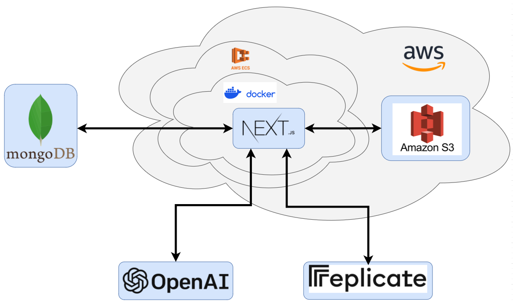

# Architecture

## 1. Introduction
This document outlines the architectural design for an AI persona web application that integrates various technologies, including:
* Next.js for frontend and backend
* Docker for containerization
* GitHub Actions for CI/CD
* Amazon ECR for container registry
* Amazon ECS for service deployment
* MongoDB for data persistence
* Amazon S3 for image storage
* OpenAI's DALL-E API for persona image generation
* Replicate API's OpenJourney model for alternative persona image generation
* OpenAI's ChatGPT API for motto generation

The application's primary functionality is to process user requests to generate artificial social media personas, including images and associated phrases.

## 2. System Architecture

### 2.1 Frontend (Next.js)
The frontend, built using Next.js, handles user input, sends requests to the backend, and displays generated content. It provides an intuitive interface for users to interact with the persona generation system.

### 2.2 Backend (Next.js)
The backend, also built using Next.js, orchestrates the workflow between the frontend, external APIs (OpenAI, Replicate), AWS services, and MongoDB. It processes requests, manages data flow, and coordinates the persona generation process.

#### 2.2.1 MongoDB Integration
The backend connects to MongoDB to store and retrieve data about personas, ensuring efficient data management and persistence.

#### 2.2.2 Image Generation Services
The backend communicates with either Replicate API's OpenJourney model or OpenAI's DALL-E API to generate persona images based on user input (persona name & descriptive prompt). The service returns a generated image URL.

#### 2.2.3 Motto Generation with ChatGPT
The backend leverages OpenAI's ChatGPT API to generate personalized mottos. It uses the original descriptive prompt and a "motto tone" as inputs to create a suitable phrase that aligns with the generated persona.

### 2.3 Persona Generation Workflow
1. **User Input**: The frontend collects user input (name, descriptive prompt, motto tone) and sends it to the backend.

2. **MongoDB Check**: The backend queries MongoDB to check for existing personas with the provided name.

3. **Image Generation**: If no existing persona is found, the backend requests a new image from OpenJourney or DALL-E using the provided description.

4. **Image Processing**: The backend downloads the generated image and uploads it to an Amazon S3 bucket, generating a unique S3 address.

5. **Data Persistence**: The backend creates a new persona entry in MongoDB (if not exists) or updates an existing one with the new image and attributes.

6. **Motto Generation**: The backend uses ChatGPT to generate a personalized motto based on the descriptive prompt and motto tone.

7. **Data Retrieval**: On request, the backend retrieves persona data from MongoDB, including S3 image addresses. It generates short-lived (60 seconds) image URLs using AWS and sends this data to the frontend.

## 3. Technology Stack
- **Frontend/Backend**: Next.js
- **Database**: MongoDB
- **Image Generation**: OpenAI DALL-E and Replicate's OpenJourney model
- **Motto Generation**: OpenAI ChatGPT
- **Cloud Services**: Amazon Web Services (S3, ECR, ECS)
- **Containerization**: Docker
- **CI/CD**: GitHub Actions

## 4. Infrastructure as Code (IaC)
Infrastructure is managed using Terraform, defining AWS resources such as S3 buckets, ECS clusters, and IAM roles. This approach ensures consistent and reproducible infrastructure deployments.

## 5. Security Considerations
- Implement HTTPS for secure communication between all components.
- Use proper access controls and authentication mechanisms for MongoDB and Amazon S3.
- Protect API keys and credentials using environment variables and AWS Secrets Manager.
- Implement rate limiting and input validation to prevent abuse.
- Regularly update and patch all system components.
- In future iterations, implement user authentication and authorization.

## 6. Scalability and Performance
- Utilize Amazon ECS for container orchestration, allowing easy scaling of application instances.
- Implement caching mechanisms to reduce database load and improve response times.
- Use Amazon CloudFront for content delivery to reduce latency for users across different geographical locations.
- Monitor system performance using Amazon CloudWatch and set up auto-scaling policies.

## 7. Monitoring and Logging
- Implement comprehensive logging throughout the application using a centralized logging solution.
- Set up monitoring and alerting using Amazon CloudWatch to track system health and performance metrics.
- Use distributed tracing to identify bottlenecks and optimize request flows.

## 8. Conclusion
This architectural design provides a comprehensive overview of the AI persona web application's components, interactions, and technologies. By following best practices for security, scalability, and performance, the system aims to deliver a robust and efficient user experience. Regular monitoring, maintenance, and iterative improvements will ensure the application's continued success and reliability.

## 9. Contributors
- [JamesTwisleton](https://github.com/JamesTwisleton)
- [Sum02dean](https://github.com/sum02dean)

We welcome contributions from the community to enhance and expand the capabilities of this AI persona generation system.
